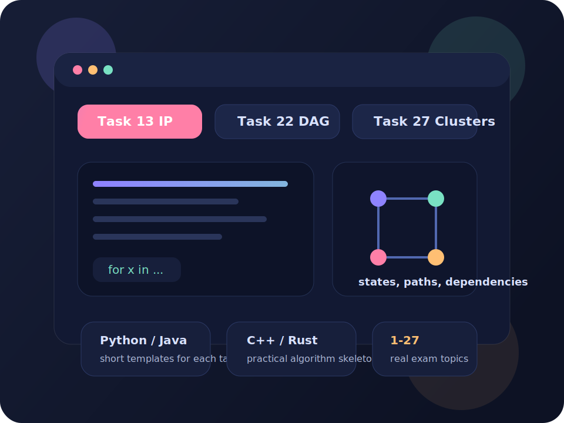

# Unified-State-Exam-CS

Статический сайт-шпаргалка по ЕГЭ по информатике с акцентом на реальные типы заданий `1-27`, краткие алгоритмы решения и кодовые каркасы на `Python`, `Java`, `C++` и `Rust`.



## Что это за проект

Сайт собран как лёгкий фронтенд без сборщика, чтобы его можно было:

- быстро открыть локально
- без лишней инфраструктуры публиковать на `GitHub Pages`
- удобно дорабатывать как коллекцию шпаргалок и шаблонов решений

Контент ориентирован не на случайные абстрактные примеры, а на реальные темы ЕГЭ по информатике: логика, базы данных, IP и маски, динамическое программирование, теория игр, процессы, кластеризация и так далее.

## Что внутри

- все номера заданий `1-27`
- краткое описание того, что обычно дано в условии
- пошаговая схема решения по каждому номеру
- короткие кодовые каркасы на `Python`, `Java`, `C++`, `Rust`
- поиск по темам и номерам
- локальные SVG-иллюстрации без внешних картинок
- готовый деплой на `GitHub Pages` через `GitHub Actions`

## Структура проекта

```text
.
|-- index.html
|-- styles.css
|-- app.js
|-- assets/
|   |-- hero-board.svg
|   |-- topic-ip.svg
|   |-- topic-games.svg
|   `-- topic-clusters.svg
`-- .github/
    `-- workflows/
        `-- deploy-pages.yml
```

## Локальный запуск

Самый простой вариант:

1. Открой `index.html` в браузере.

Если нужен локальный сервер:

1. Запусти любой static server.
2. Открой сайт по локальному адресу сервера.

## Публикация на GitHub Pages

1. Убедись, что в `Settings -> Pages` выбран источник `GitHub Actions`.
2. Запушь изменения в ветку `main`.
3. Дождись завершения workflow `Deploy GitHub Pages`.

Если Pages уже настроен, сайт будет обновляться автоматически после каждого push в `main`.

## По содержанию

Внутри сайта используются:

- реальные номера и актуальные темы ЕГЭ
- короткие учебные алгоритмы
- кодовые каркасы, которые нужно адаптировать под конкретный вариант

Это не архив официальных формулировок задач, а именно удобная шпаргалка для повторения паттернов решения.

## Дальше можно развивать

- добавить по `1-2` разобранных примера на каждый номер
- сделать отдельные страницы для сложных тем `22`, `24`, `26`, `27`
- добавить переключение между кратким и расширенным режимом шпаргалок
