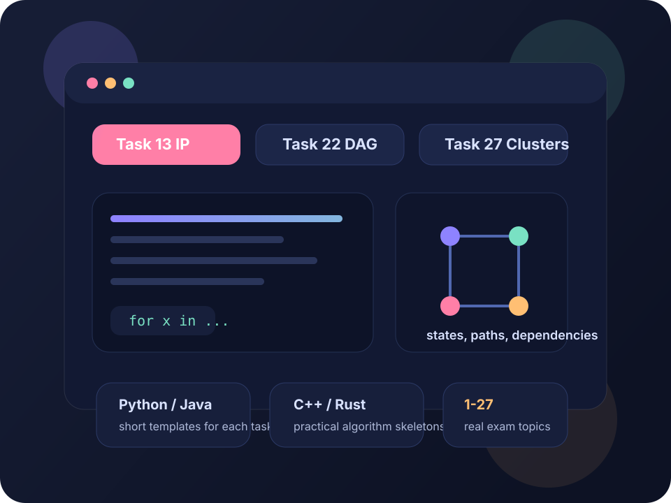

# Unified-State-Exam-CS

Статический сайт-шпаргалка по ЕГЭ по информатике с акцентом на реальные типы заданий `1-27`, краткие алгоритмы решения и кодовые каркасы на `Python`, `Java`, `C++` и `Rust`.



## Что это за проект

Сайт собран как лёгкий фронтенд без сборщика, чтобы его можно было:

- быстро открыть локально
- без лишней инфраструктуры публиковать на `GitHub Pages`
- удобно дорабатывать как коллекцию шпаргалок и шаблонов решений

Контент ориентирован не на случайные абстрактные примеры, а на реальные темы ЕГЭ по информатике: логика, базы данных, IP и маски, динамическое программирование, теория игр, процессы, кластеризация и так далее.

## Что внутри

- все номера заданий `1-27`
- краткое описание того, что обычно дано в условии
- пошаговая схема решения по каждому номеру
- короткие кодовые каркасы на `Python`, `Java`, `C++`, `Rust`
- 9 проверенных самостоятельных Python-разборов по присланным фото (рекурсия, логика, маски, слова, цифровые коды, системы счисления, графы)
- пошаговые разборы каждого из 27 номеров: условие, 3 шага, полный автономный Python-пример, контрольный ответ и адаптация под свой вариант
- фильтры по типу Python-примера, контрольный вывод, пояснения и кнопка копирования
- поиск по темам и номерам
- локальные SVG-иллюстрации без внешних картинок
- готовый деплой на `GitHub Pages` через `GitHub Actions`

## Структура проекта

```text
.
|-- index.html
|-- styles.css
|-- app.js
|-- python-examples.js
|-- walkthroughs.js
|-- check-python-examples.js
|-- assets/
|   |-- hero-board.svg
|   |-- topic-ip.svg
|   |-- topic-games.svg
|   `-- topic-clusters.svg
`-- .github/
    `-- workflows/
        `-- deploy-pages.yml
```

## Локальный запуск

Самый простой вариант:

1. Открой `index.html` в браузере.

Если нужен локальный сервер:

1. Запусти любой static server.
2. Открой сайт по локальному адресу сервера.

## Как пользоваться Python-примерами

1. На сайте открой раздел «Python-примеры» и выбери тип задачи. Поиск слева ищет также по примерам.
2. Нажми «Скопировать код», создай файл `solution.py` в PyCharm и вставь туда текст. Можно запускать и из терминала: `python solution.py` (на Linux/macOS иногда `python3 solution.py`). Нужен Python 3.10+; дополнительные пакеты не требуются.
3. Сравни результат с полем «Проверка» карточки. После этого поменяй данные, перечисленные в «Что менять», на данные своего варианта. Примеры с пометкой «адаптация» показывают приём решения: точные условия на двух фото неразборчивы.
4. Для шаблонов заданий с `open('17.txt')`, `open('24.txt')` и т. п. положи файл варианта в ту же рабочую папку, откуда запускаешь Python; если данные в `.xlsx`, сначала экспортируй подходящий лист в CSV или адаптируй чтение.

У каждого номера в разделе «Задания» нажми **«Открыть пошаговый разбор с ответом»**: там полный автономный пример на Python. Он запускается без входных файлов и позволяет сначала понять механику на небольших данных; затем подставь параметры из своего задания.

Исходный код рекурсии на фото хранил массив из `10**7` элементов и вычислял огромные значения — поэтому процесс завершался с кодом 137 (SIGKILL). В новой версии множители сокращаются алгебраически и вычисление занимает доли секунды. Для обычных переборов следи за объёмом `product`: при увеличении длины число комбинаций растёт экспоненциально.

Проверка примеров и всех Python-шаблонов из 27 заданий:

```sh
node check-python-examples.js
```

Скрипт запускает 9 примеров с фото и 27 примеров из разборов, сверяет ответы, а также проверяет синтаксис и пробный запуск 25 уникальных Python-шаблонов (игровой шаблон общий у номеров 19–21). Для файловых шаблонов создаются временные учебные входные файлы. Шаблоны других языков не входят в эту проверку.

## Публикация на GitHub Pages

1. Убедись, что в `Settings -> Pages` выбран источник `GitHub Actions`.
2. Запушь изменения в ветку `main`.
3. Дождись завершения workflow `Deploy GitHub Pages`.

Если Pages уже настроен, сайт будет обновляться автоматически после каждого push в `main`.

## По содержанию

Внутри сайта используются:

- реальные номера и актуальные темы ЕГЭ
- короткие учебные алгоритмы
- кодовые каркасы, которые нужно адаптировать под конкретный вариант

Это не архив официальных формулировок задач, а именно удобная шпаргалка для повторения паттернов решения.

## Дальше можно развивать

- добавить по `1-2` разобранных примера на каждый номер
- сделать отдельные страницы для сложных тем `22`, `24`, `26`, `27`
- добавить переключение между кратким и расширенным режимом шпаргалок
